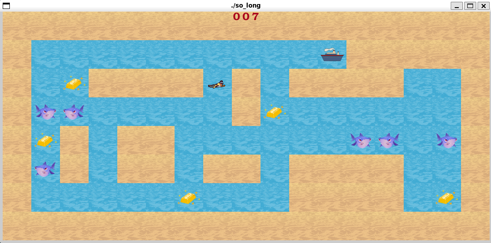
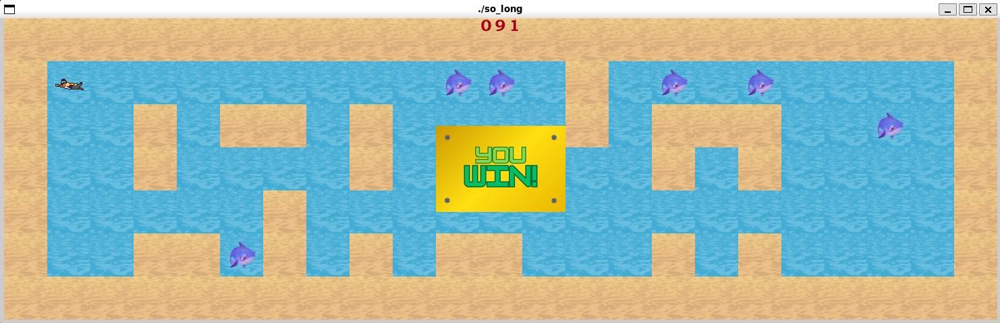
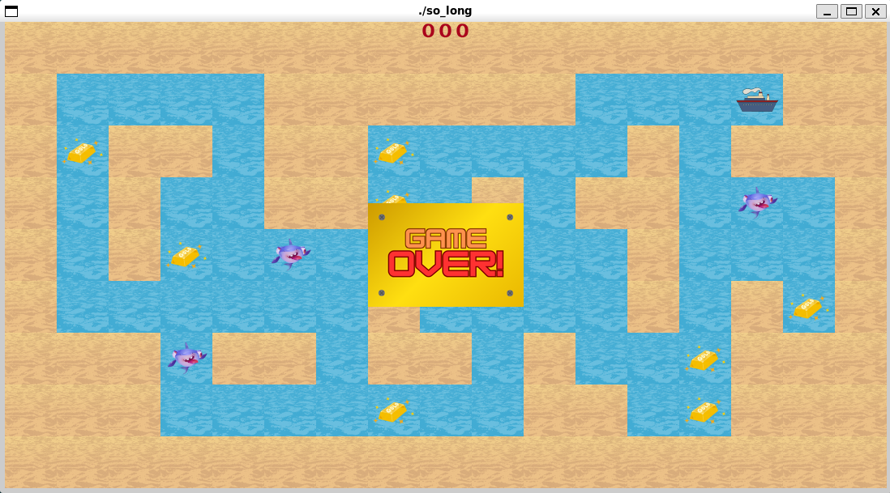

# 🎮 so_long

  **Game running** 
  

**Victory screen** 

  

**Defeat screen** 

  

**Description**  
2D tile-based game where the player collects items, avoids enemies, and reaches the exit on a given map.

**🛠️ Technologies**  
- C language  
- MiniLibX graphics library  

**🎯 Key Learning Outcomes**  
- Rendering and updating sprites on a grid  
- Handling keyboard events for movement  
- Map validation (e.g., flood-fill for reachability)
